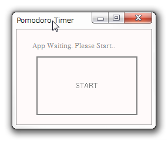
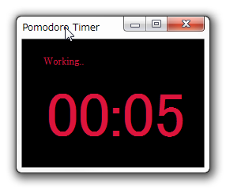
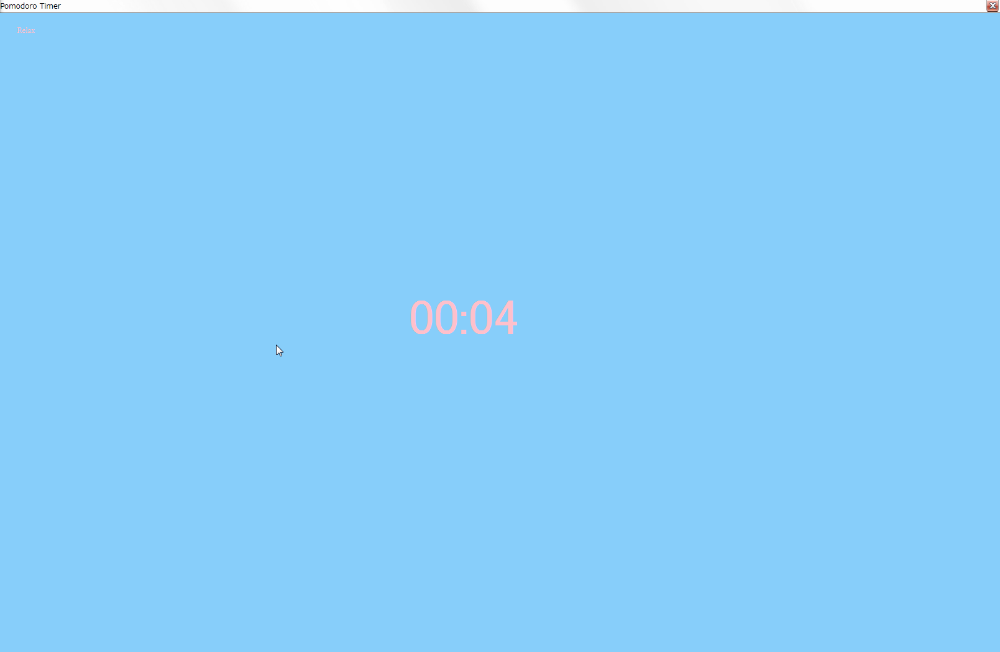

# PomodorTimer

ただのポモドーロタイマーです。ホントにただのポモドーロタイマーです.

作業時間25分 + 強制休憩5分のタイマーです.

## ポモドーロ・テクニックについて

- [7年間ポモドーロテクニックを使って仕事をしている私が、熱くその利点について語ります！！ | キムラボ](https://akirako.jp/pomodoro-technic/)
- [今日から始める生産性アップ術。ポモドーロ・テクニック再入門ガイド | ライフハッカー［日本版］](https://www.lifehacker.jp/2014/07/140714pomodoro.html)
- [最強の時間管理術「ポモドーロ・テクニック」の方法とお勧めタイマー | アイハラ独学工房](https://koboblog.net/pomodoro-technique/)

## 機能

機能はたったのこれだけ

・機能1: 25分後にメッセージを表示
・機能2: 強制的に作業を止めるように仕向け強制的に5分間休憩させる

## 動作イメージ

1. 起動画面

2. 作業中画面

3. 休憩画面

## Version

 - [v1.1](https://github.com/peace098beat/PomodoroTimer/releases/tag/v1.1) (2019-01-28)
 - [v1.0](https://github.com/peace098beat/PomodoroTimer/releases/tag/v1.0) (2018-11-20)

## Release

 - [v1.1] マルチディスプレイに対応

## Install

インストールは必要ありません[ここ](https://github.com/peace098beat/PomodoroTimer/releases/tag/v1.0)からexeファイルをダウンロードして使ってください.

## Author

[@tomoyuki_noahra](https://twitter.com/tomoyuki_nohara)

## License

[MIT](http://b4b4r07.mit-license.org)

